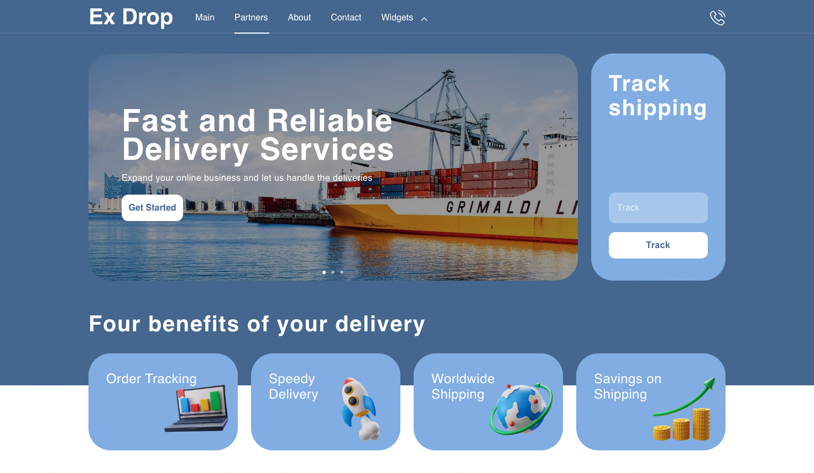

 

  <a href="https://example-delivery-service.netlify.app/" target='_blank'>
    
<h3 align="center">Delivery Service Website</h3>
  

    A web application for a delivery service built using React, SCSS, Jest, and a RESTful API.
     
    <a href="https://github.com/YourUsername/delivery-service-website"><strong>Explore the code »</strong></a>
     
     
    <a href="https://example-delivery-service.netlify.app/">View Demo</a>
  

<!-- ABOUT THE PROJECT -->

## About The Project

The Ex Drop Website is a web application designed for a delivery service company. It is built using modern web technologies including React, SCSS, Jest, and a RESTful API. The application enables users to easily calculate cost of delivery orders, track their packages, and allows users to find their city or address visually.

### - Order Cost Calculator

Users can fill out an intuitive order form, specifying pickup and delivery details, such as cities or addresses. The website uses an API to calculate the estimated cost and time of delivery based on the distance between the chosen cities or addresses in the United States. The business logic takes into account factors like package weight, dimensions, and any additional requirements to provide accurate estimates.

### - Interactive Map and Search

The website includes an interactive map that allows users to find their city or address visually. They can click on the map to select their desired pickup and delivery locations. Additionally, users can use a search function to find specific cities or addresses. The website integrates with the API to fetch the latitude and longitude coordinates for accurate distance calculation.

### - Pickup Point Filtering

Users can filter pickup points based on various criteria such as type (e.g., post office, pick up points) or payment method (e.g., cash, credit card). This feature helps users find pickup points that are most convenient for them and align with their preferred payment methods.

### Built With

- REACT JS
- SCSS
- Jest
- RESTful API

## Contact

Vladislav Lychak - [@LinkedIn](https://www.linkedin.com/in/vladislav-lychak/) - lycakvladislav@gmail.com

Project Link: [https://ex-drop-delivery.netlify.app/](https://ex-drop-delivery.netlify.app/)

(<a href="#readme-top">back to top</a>)

<!-- MARKDOWN LINKS & IMAGES -->
<!-- https://www.markdownguide.org/basic-syntax/#reference-style-links -->

[react.js]: https://img.shields.io/badge/React-20232A?style=for-the-badge&logo=react&logoColor=61DAFB
[react-url]: https://reactjs.org/
